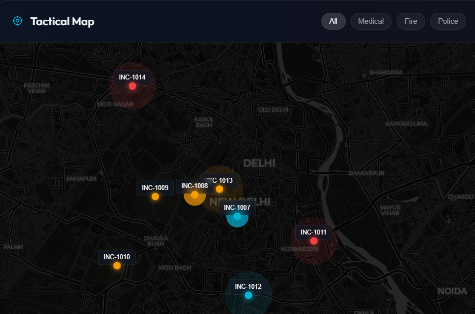
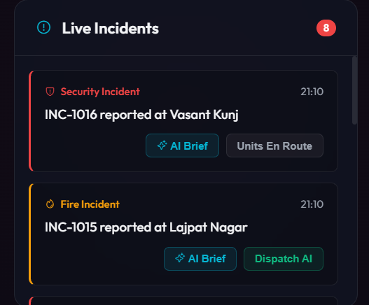
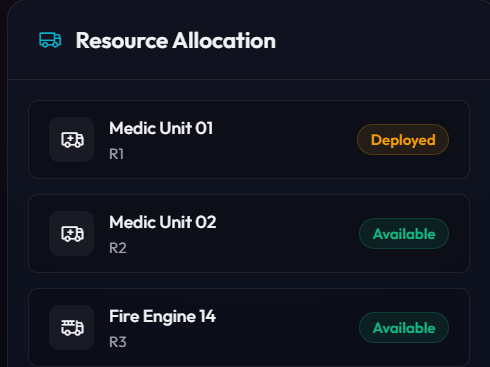

<div align="center">
  
  <h1>NexCommand 🚨</h1>
  <p><strong>Intelligent Rapid Crisis Response & Resource Allocation Dashboard</strong></p>

  [](https://nex-command.vercel.app?_vercel_share=CTsRbfxM5ncRxVIJTDykx08Ij3LZIykJ)
  [](https://vitejs.dev/)
  [](https://aistudio.google.com/)
</div>

<br/>

**NexCommand** is an intelligent, rapid crisis response platform designed to aggregate emergency feeds and instantly allocate resources. During an urban crisis, control rooms are flooded with fragmented data, causing critical delays. NexCommand bridges this gap by acting as an AI-assisted "control tower."

---

## 🔗 Live Prototype
**Experience the live prototype here: [NexCommand on Vercel](https://nex-command.vercel.app?_vercel_share=CTsRbfxM5ncRxVIJTDykx08Ij3LZIykJ)**

---

## 🌟 Core Features

### 1. Interactive Tactical Map
Powered by Leaflet.js with CartoDB Dark Matter tiles, providing geographic awareness in a high-stress environment.


### 2. Gemini AI Situation Briefs & Live Feed
Uses Google's live `gemini-flash-latest` model. Click **"AI Brief"** to instantly analyze incident parameters and generate immediate tactical response advice.


### 3. Intelligent Resource Dispatch
Automated matching of crises with the nearest available physical assets (Ambulances, Fire Engines, Drones). 


### 4. Glassmorphism UI
A premium, dark-themed command center built to reduce operator eye strain and highlight severe alerts using neon accents.

---

## 🚀 Quick Start (For Local Testing)

While the live Vercel link is the easiest way to experience NexCommand, you can also run it locally.

### Prerequisites
- [Node.js](https://nodejs.org/) must be installed on your machine.
- A free Gemini API Key from [Google AI Studio](https://aistudio.google.com/).

### Setup
1. Clone this repository.
2. Create a `.env.local` file in the root directory and add your key:
   ```env
   VITE_GEMINI_API_KEY="YOUR_GEMINI_API_KEY_HERE"
   ```

### For Windows:
Double-click the `start.bat` file in the root folder, OR run:
```cmd
start.bat
```

### For Mac / Linux:
```bash
chmod +x start.sh
./start.sh
```

### Manual Boot:
```bash
npm install
npm run dev
```

The terminal will provide a local URL (usually `http://localhost:5173/`).

---

## 🛠️ Tech Stack
- **Build Tool**: Vite
- **Frontend**: Vanilla HTML, CSS3 (Custom Properties & Glassmorphism), ES6 JavaScript
- **Mapping**: Leaflet.js
- **Artificial Intelligence**: Google Gemini 1.5 Flash API

---

## 🔒 Security Note
This prototype is built primarily using open-source libraries and free-tier CDN assets (like CartoDB basemaps and Phosphor Icons). The Gemini API key must be supplied locally via `.env.local` or securely injected via Vercel Environment Variables, keeping the public codebase 100% secure.
